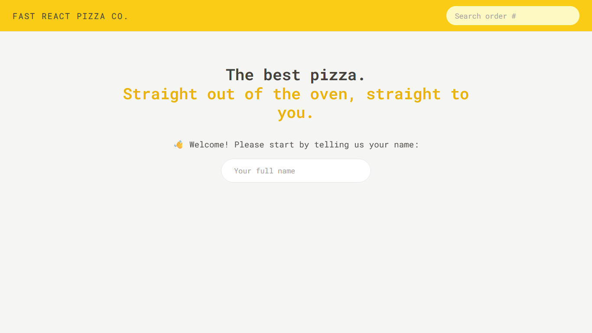
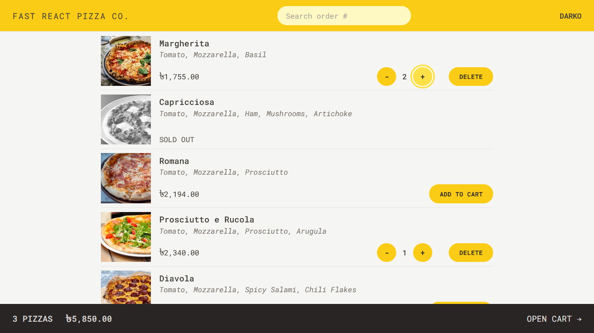
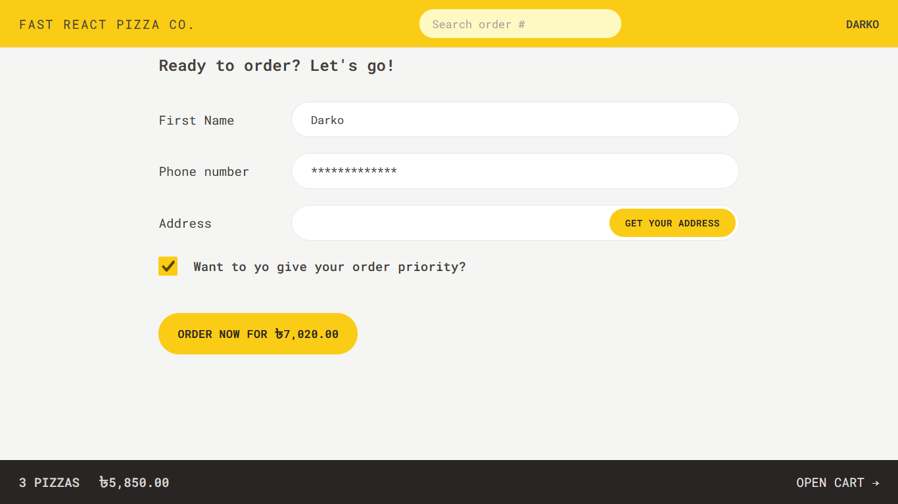
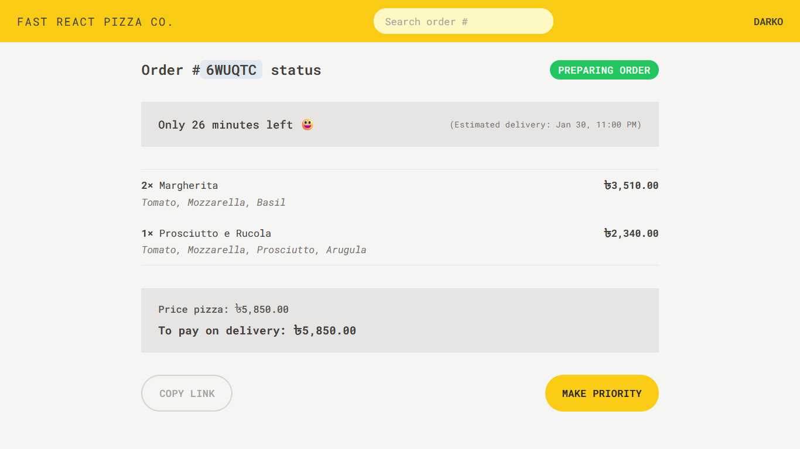

# 🍕 Fast React Pizza Co.

A pizza ordering application that allows users to view and order pizzas from a menu. It features a responsive design, cart management, and user authentication for a seamless ordering experience.

---

## ✨ Features

- **Guest Ordering**: No user accounts or login required. Users simply enter their name to start an order.
- **Dynamic Menu**: The pizza menu is loaded from an API, ensuring it can be updated without app changes.
- **Cart System**: Users can add multiple pizzas to a cart before placing an order.
- **Simple Checkout**: Orders require only:
  - Name
  - Phone number
  - Address
  - Optional: GPS location for easier delivery
- **Priority Ordering**: Users can mark their order as “priority” for an additional 20% fee, even after placing the order.
- **Order Placement**: Orders are sent via a POST request to the API.
- **Order Tracking**: Each order receives a unique ID for later lookup.
- **Cart Management**: Users can review, modify, or remove items from their cart before ordering.
- **Responsive Design**: The app works well on mobile, tablet, and desktop.

---

## 🚀 How to Use

1. **[Go to the website](https://fast-react-pizza-by-darkoray.netlify.app/)**
2. **Enter your name** – This is all that's required to get started.
3. **Browse the menu** – View available pizzas, which are loaded live from our kitchen.
4. **Add pizzas to your cart** – Select one or more pizzas and customize your order.
5. **Review your cart** – Adjust quantities or remove items before placing your order.
6. **Enter your details** – Provide your name, phone number, and delivery address.  
   📍 Optionally share your GPS location for faster delivery.
7. **Choose priority** – Mark your order as “Priority” for faster delivery (additional 20% fee).  
   ✅ _You can also add priority after placing your order._
8. **Place your order** – Confirm and receive a unique order ID.
9. **Track your order** – Use your order ID to look up your status anytime.

---

## 🖼️ Layouts

Core structural components that define the application's layout.

- `AppLayout.jsx`: Main layout wrapper for the entire application.
- `Sidebar.jsx`: Navigation and city list display panel.
- `Map.jsx`: Interactive map component for visualizing cities.

---

## 🧩 Components

**UI Layout**

- `AppLayout` – Main app wrapper
- `Header` – Navigation with cart & user info
- `Home` – Welcome page
- `Loader` & `Error` – Feedback components

**Cart**

- `Cart` – Full cart page
- `CartOverview` – Cart summary (always visible)
- `CartItem` – Single item in cart
- `UpdateItemQuantity` & `DeleteItem` – Cart controls

**Menu**

- `Menu` – Pizza listing
- `MenuItem` – Individual pizza card

**Order**

- `CreateOrder` – Checkout form
- `Order` – Order details page
- `SearchOrder` – Look up order by ID
- `UpdateOrder` – Add priority after order

**User**

- `CreateUser` – Name input (no login)
- `Username` – Displays current user

**Services & Utilities**

- `apiRestaurant` – Fetches pizza menu
- `apiGeocoding` – Gets address from GPS
- `helpers` – Format currency, calculate time

**State Management**

- `store.js` – Redux store
- `cartSlice.js` & `userSlice.js` – Redux slices

---

## 🛠️ Technologies Used

- **React 18**– Component-based UI library
- **Vite** – Fast build tool & dev server
- **Redux Toolkit**– Global state management
- **React Redux** – React bindings for Redux
- **React Router DOM** – Client-side navigation
- **Tailwind CSS** – Utility-first CSS framework

---









---

## 📂 Project Structure

```
src/
├─ features/
│  ├─ cart/
│  │  ├─ Cart.jsx
│  │  ├─ CartItem.jsx
│  │  ├─ CartOverview.jsx
│  │  ├─ cartSlice.js
│  │  ├─ DeleteItem.jsx
│  │  ├─ EmptyCart.jsx
│  │  └─ UpdateItemQuantity.jsx
│  ├─ menu/
│  │  ├─ Menu.jsx
│  │  └─ MenuItem.jsx
│  ├─ order/
│  │  ├─ CreateOrder.jsx
│  │  ├─ Order.jsx
│  │  ├─ OrderItem.jsx
│  │  ├─ SearchOrder.jsx
│  │  └─ UpdateOrder.jsx
│  └─ user/
│     ├─ CreateUser.jsx
│     ├─ Username.jsx
│     └─ userSlice.js
├─ services/
│  ├─ apiCurrencyRate.js
│  ├─ apiGeocoding.js
│  └─ apiRestaurant.js
├─ ui/
│  ├─ AppLayout.jsx
│  ├─ Button.jsx
│  ├─ Countdown.jsx
│  ├─ Error.jsx
│  ├─ Header.jsx
│  ├─ Home.jsx
│  ├─ LinkButton.jsx
│  └─ Loader.jsx
├─ utils/
│  └─ helpers.js
├─ App.css
├─ App.jsx
├─ index.css
├─ main.jsx
└─ store.js
```

---

## 📄 License & Credits

This project is part of the course [**"The Ultimate React Course 2025: React, Next.js, Redux & More"**](https://www.udemy.com/course/the-ultimate-react-course/) by **Jonas Schmedtmann** and is provided for **learning purposes only**.

© by Jonas Schmedtmann. You can use it for your portfolio or learning. Do not use it to teach or redistribute as your own work.
